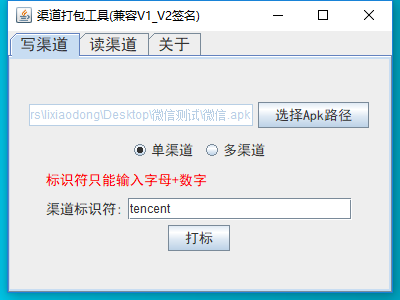
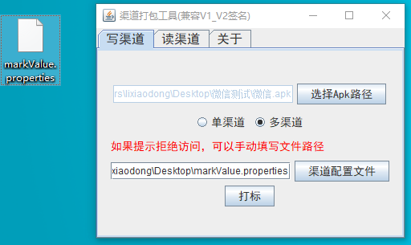
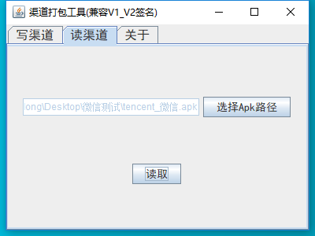
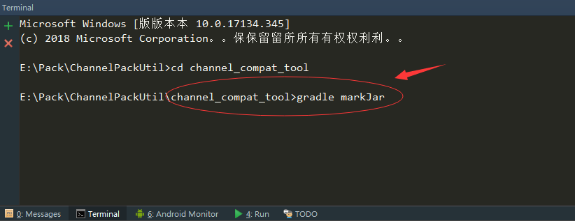

# APK多渠道打包工具
## 前言：
	因公司需求，需求对外提供多渠道打包解决方案，研究友盟和美团方案之后，最终决定以美团的多渠道方案来构建此渠道工具。因为我公司是SDK开发的，接入我们的大部分是游戏开发者，游戏app动辄1G多大小，我们知道app越大每次编译运行就越慢，而友盟方案每次打一个渠道包都需要重新编译然后替换清单文件的自定义的值，所以我们的业务比较适合美团解决方案，无需重新编译。

	友盟:
	
		缺点：
	
			1.配置繁琐，需要配置gradle,清单文件
	
			2.打包时间太长，因为每次打包需要重新编译
	
		优点：
	
			1.灵活性高，我们可以针对不同的渠道，定制不一样的app启动图标
	
			2.兼容性高，无需考虑 V1，V2签名方式
	
	美团：  
		缺点：
	
			1.灵活性低，不能对不同的渠道实现定制化需求
	
			2.兼容性低，需要考虑 V1 , V2签名方式
	
		优点：
	
			1.配置简单
	
			2.打包时间短，无需重新编译、

## 渠道工具使用方式：

写渠道：
      

 		

       							

如上图所示：

1. 先选择APK路径

2. 选择渠道方式

   单渠道：在渠道标识符输入框填写渠道名称即可

   多渠道：

   	创建一个以.properties的文件，文件内容以 key = value 形式配置渠道
   	
   	如果没有选择渠道文件，将使用默认配置文件 (C:/Users/Administrator/AppData/Local/Temp/iapppay)

   3. 点击打标按钮

   4. 等候打包完成

读渠道：

	
	
	如上图所示：
	
		1.先选择APK路径
	
		2.点击读取
	
		3.等候读取成功

## 项目模块介绍：

	app:  用于测试读取渠道的demo
	
	app_reader:  用于app读取渠道信息工具模块
	
	channel_compat_tool:  渠道工具页面代码
	
	v1_write:  V1签名写渠道方式
	
	v1_reader: V1签名读渠道方式
	
	v2_writer: V2签名写渠道方式
	
	v2_reader:V2签名读渠道方式
	
	resources： 存放各个模块的jar包，方便自定义接入

## 问题：

1. 打包速度慢？

   - apk大小会影响打包速度，因为 copy 文件需要时间。

   - 确保使用 JDK>=1.7版本以上， 1.7版本以上就会使用系统版本 copy 文件，效率最高

2. 修改了项目某些模块，如何打 jar 包？

   已经针对每个模块都编写了一个 makeJar 任务，任务完成 jar 存放在 模块/build/libs/下面

   - AndroidStudio打开Gradle任务栏方式

   

   - 命令行输入 makeJar 任务方式

     

## 参考：

	[美团Android自动化之旅—生成渠道包](https://tech.meituan.com/mt_apk_packaging.html)
	
	[新一代开源Android渠道包生成工具Walle](https://tech.meituan.com/android_apk_v2-signature_scheme.html)
	
	[Gradle如何打可运行 jar 包](http://www.itkeyword.com/doc/1064747557401846x246/exporting-jar-file-with-manifest-attribute-in-android-studio)

